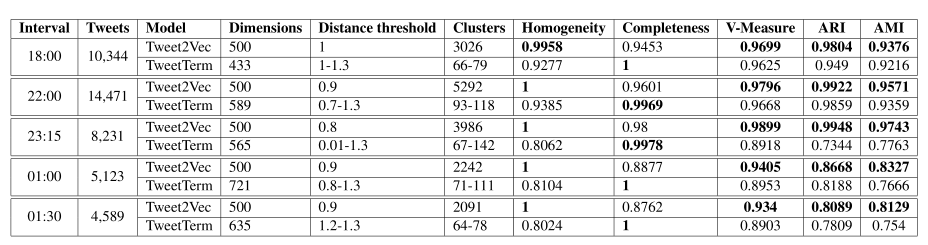
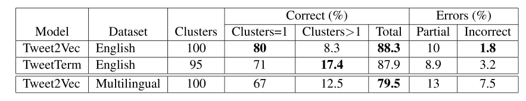

# First look at something from Machine Learning

A brief document 'written' as a way to layout my thoughts on this new subject. Mostly just copying and rephrasing/paraphrasing. (written in markdown)

## Definitions (for a Beginner)
**ANNs(Artificial neural networks)** - Allow to generate dense vector representations (embeddings). "ANNs, like people, learn by example. An ANN is configured for a specific application, such as pattern recognition or data classification, through a learning process."[^ann]

**Embeddings** - Set of language modelling and feature learning techniques in natural language processing (NLP) where words or phrases from the vocabulary are mapped to vectors of real numbers.[^embed]

**Document-term matrix** - Matrix that describes the frequency of terms that occur in a collection of documents.[^document-term]

**Clustering** - The task of grouping a set of objects in such a way that objects in the same group (cluster) are more similar to each other than to those in other clusters.[^cluster]

**Ground-truth** - Information provided by direct observation (i.e. empirical evidence) as opposed to information provided by inference. The term "ground truth" refers to the accuracy of the training set's classification for supervised learning techniques.[^ground]

**Flat clustering** - Creates a flat set of clusters without any explicit structure that would relate cluster to each other.[^flat]

**Hierachical clustering** - Outputs a hierarchy, a structure that is more informative than clusters returned by flat clustering.[^hierarchical]

[^ann]: <https://www.doc.ic.ac.uk/~nd/surprise_96/journal/vol4/cs11/report.html#Introduction%20to%20neural%20networks>
[^embed]: <https://en.wikipedia.org/wiki/Word_embedding>
[^document-term]: <https://en.wikipedia.org/wiki/Document-term_matrix>
[^cluster]: <https://en.wikipedia.org/wiki/Cluster_analysis>
[^ground]: <https://en.wikipedia.org/wiki/Ground_truth>
[^flat]: <https://nlp.stanford.edu/IR-book/html/htmledition/flat-clustering-1.html#ch:flatclust>
[^hierarchical]: <https://nlp.stanford.edu/IR-book/html/htmledition/hierarchical-clustering-1.html#ch:hierclust>

## Bullet Points on "Breaking News Prediction" document
### Chapter 1 (Introduction)

* Evaluation of the character-based neural embeddings on the tweet clustering task.

* Show how to employ character-based tweet embeddings for the task for tweet clustering and demonstrate in the experimental evaluation that the proposed approach significantly outperforms the current state-of-the-art in tweet clustering for breaking new detection.

### Chapter 2 (Related Work)

* Word2vec is by far the most popular approach for creating embeddings.

* Extending the evaluation of the Tweet2Vec model to the tweet clustering task.

### Chapter 3 (Experimental Evaluation)

* This chapter is relatively dense and concise. Bullet pointing doesn't seem applicable. *(Just re-read the document)*

> **Dataset**
>
> Processing tweets and creating a subset which is less sparse.
>
> **Tweet representation approaches**
>
> Clustering tweets (using fuzzy string matching to generate partial labelling, then using different models (Tweet2Vec, TweetTerm) to generate embeddings, then employ hierarchical clustering algorithm).
>
> Cluster evaluation using standard metrics for evaluation on the partial labelled clusters.
>
> For threshold on hierarchical clustering we use grid search. Generate list of values in the range from 0.1 to 1.5 with 0.1 increment step and examine performance. Produce flat clusterings for each value of the distance threshold from the grid and compare them with respect to the quality metrics.
>
> Manual cluster evaluation by human evaluators on a selection from clusters now containing whole dataset.

### Chapter 4 (Results)

#### Results of Clustering Evaluation

* Results in table show scores of bests clusters per interval.

* Tweet2Vec exhibits better clustering performance comparing to the baseline according to the majority of the evaluation metrics.

* Tweet2Vec fails to perfectly separate the ground-truth clusters only at 18:00 interval. Thus Tweet2Bec us able to replicate the results of the fuzzy string matching algorithm that was used to generate the ground-truth labelling.

. The vertical red line indicates the maximum V-Measure score.")

* Optimal distance threshold for Tweet2Bec clustering according to V-Measure is on internal \[0.8; 1] for 22:00 interval.

#### Results of Manual Cluster Evaluation

* Tweet2Vec highest total % and least number of incorrect clusters.

* Demonstated that Tweet2Vec is able to cluster tweets in different languages.

### Chapter 5 (Discussion)
